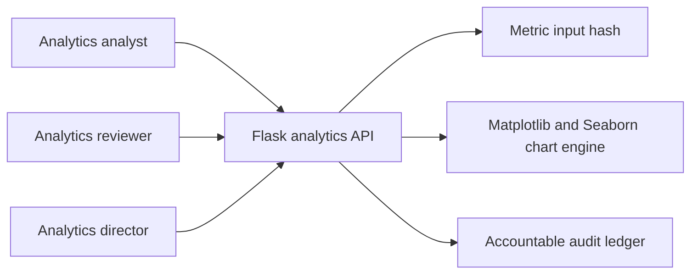
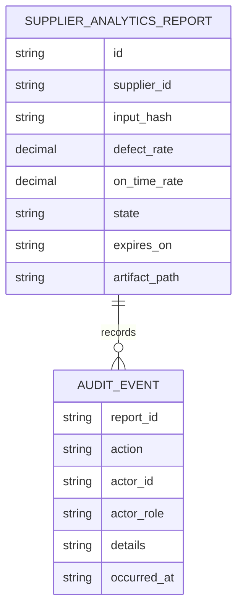
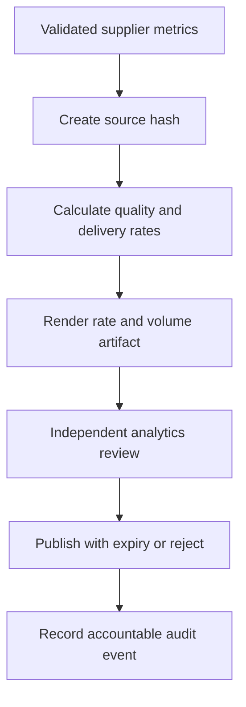
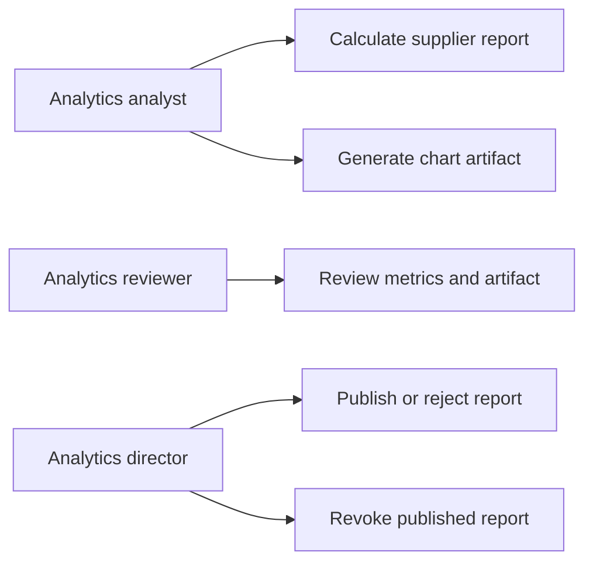
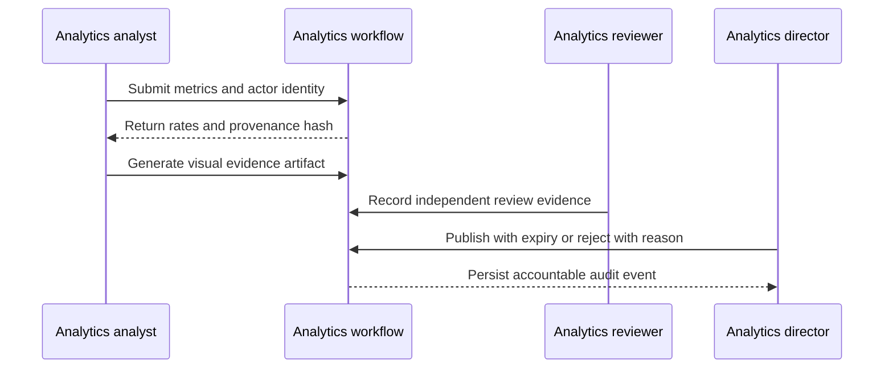

# Matplotlib and Seaborn Supplier Analytics Visualization Platform

## The Problem
Supplier quality and delivery metrics often remain in disconnected operational files. Without provenance, governed visualization, independent review, and controlled publication, decision makers cannot establish whether a report reflects validated source metrics or whether it should still be relied upon.

## The Solution
This platform converts validated supplier defect, delivery, and late delivery metrics into a provenance-hashed analytics report. It renders a headless Matplotlib and Seaborn evidence artifact with rate and volume views, requires independent analytics review before a director may publish with an expiry or reject, and supports revocation when corrected source evidence invalidates a published report. Every action records a named actor, role, detail, and timezone-aware UTC timestamp.

## Live Demo & Tech Stack
The service binds to `0.0.0.0:17500` for LAN access. It uses Python, Flask, Matplotlib with the headless Agg renderer, Seaborn, SHA-256 provenance, dataclasses, executable tests, and GitHub Actions.

| Concern | Implementation |
| --- | --- |
| Source integrity | Supplier metric snapshot and SHA-256 input hash |
| Analytics | Defect rate and on-time delivery rate calculated from validated operational metrics |
| Visualization | Two-panel Matplotlib and Seaborn artifact for rate and source-volume evidence |
| Governance | Independent analytics review before reasoned publication, rejection, expiry, or revocation |
| Accountability | Actor ID, role, detail, and UTC timestamp stored for each lifecycle event |

## Local Setup & Run Instructions
```bash
git clone https://github.com/kholipha-ahmmad-al-amin/matplotlib-seaborn-supplier-analytics-visualization-platform.git
cd matplotlib-seaborn-supplier-analytics-visualization-platform
python3 -m venv .venv
source .venv/bin/activate
pip install -r requirements.txt
python3 tests/test_analytics.py
python3 app.py
```

Create an analytics report with a named analyst and valid supplier metrics.

```bash
curl -X POST 'http://127.0.0.1:17500/reports?id=REP-282-AUDIT&supplierId=SUP-282&defects=4&deliveries=100&late=7' \
  -H 'X-Role: analytics-analyst' -H 'X-Actor: analyst-282'
```

## System Documentation (Mermaid.js)
### System Architecture Diagram


### Entity Relationship Diagram


### Data Flow Diagram


### Use Case Diagram


### Sequence Diagram


## Owner
Created and maintained by Kholipha Ahmmad Al-Amin.
Software Engineer and AI Specialist
Founder and CEO of EquiSaaS BD
Principal Consultant at AR IT Consultancy
Full Stack Developer and SaaS Product Builder
### Official links
Portfolio: https://kholipha-ahmmad-al-amin.equisaas-bd.com/
GitHub: https://github.com/kholipha-ahmmad-al-amin
LinkedIn: https://www.linkedin.com/in/kholipha-ahmmad-al-amin
X: https://x.com/al_amin5519
Facebook: https://www.facebook.com/kholipha.ahmmad.al.amin
Instagram: https://www.instagram.com/kholipha.ahmmad.al.amin
## Ownership
This project was created and is maintained by Kholipha Ahmmad Al-Amin.
